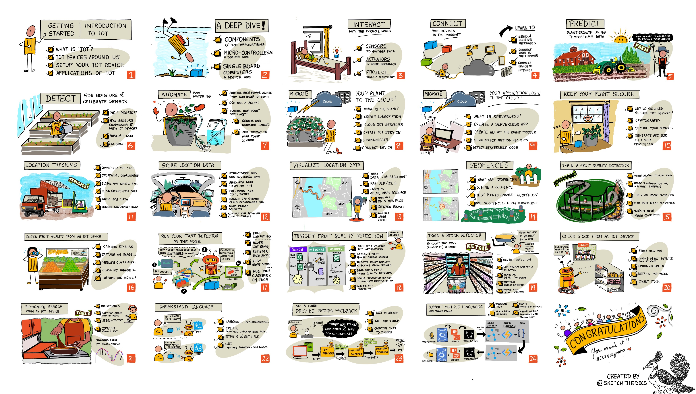

## 关于本项目

微软的Azure云倡导者很高兴提供一个为期12周、包含24课的课程，内容涉及物联网基础。每一课都包括课前和课后测验、完成课程的书面指导、解决方案、作业等。基于项目的教学方法让您在构建项目的过程中学习，这是一种被证明能让新技能“牢记”的方法。

这些项目涵盖了食品从农田到餐桌的整个过程。这包括农业、物流、制造业、零售和消费者环节——这些是物联网设备应用广泛的热门行业领域。你可访问该[网址](https://microsoft.github.io/IoT-For-Beginners/#/)阅读英文原版，访问该[仓库](https://github.com/microsoft/IoT-For-Beginners)获取所有的课程资料，微软将网课发布在油管上，点击这个[链接](https://www.youtube.com/playlist?list=PLmsFUfdnGr3xRts0TIwyaHyQuHaNQcb6-)获取相关内容。

本仓库存储了本人在这门课程学习过程中所使用到的所有资料（包括幻灯片、电子书、课前&课后习题、作业、项目实战等），并采用原版教程中推荐的3种硬件中的`Arudino`为基础进行学习，另外两种分别是树莓派和虚拟硬件，学习者可自行选择。若本项目对您有所帮助，请在页面右上角点个 Star ⭐ 支持一下，谢谢！

**另**：清华大学出版社已和微软合作整理这门教程的所有内容，并翻译成中文书籍[《深入浅出IoT：完整项目通关实战》](http://www.tup.tsinghua.edu.cn/bookscenter/book_09887501.html)出版，可按需购买。

## 进度表

|        章节         |          小节           |                             视频                             |                 作业                 | 项目 |
| :-----------------: | :---------------------: | :----------------------------------------------------------: | :----------------------------------: | :--: |
| *1-getting-started* |  1-introduction-to-iot  | ▶️[正课](https://www.youtube.com/watch?v=bVFfcYh6UBw&list=PLmsFUfdnGr3xRts0TIwyaHyQuHaNQcb6-&index=1&t=169s)    ⏰[答疑](https://www.youtube.com/watch?v=YI772q5v3yI&list=PLmsFUfdnGr3xRts0TIwyaHyQuHaNQcb6-&index=2) | <a href="课程内容\作业\01.md">✍🏼</a> |      |
|                     |      2-deeper-dive      | ▶️[正课](https://www.youtube.com/watch?v=t0SySWw3z9M&list=PLmsFUfdnGr3xRts0TIwyaHyQuHaNQcb6-&index=4)    ⏰[答疑](https://www.youtube.com/watch?v=tTZYf9EST1E&list=PLmsFUfdnGr3xRts0TIwyaHyQuHaNQcb6-&index=4) | <a href="课程内容\作业\02.md">✍🏼</a> |      |
|                     | 3-sensors-and-actuators |                                                              |                                      |      |
|                     |   4-connect-internet    |                                                              |                                      |      |

