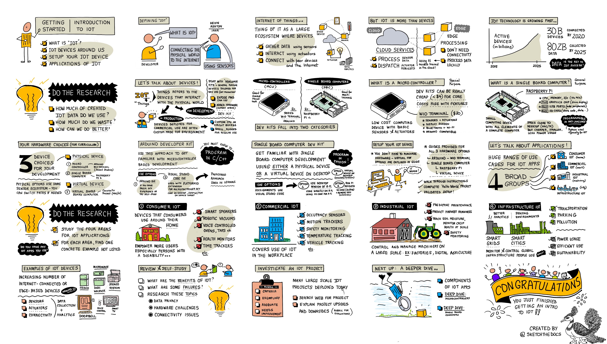
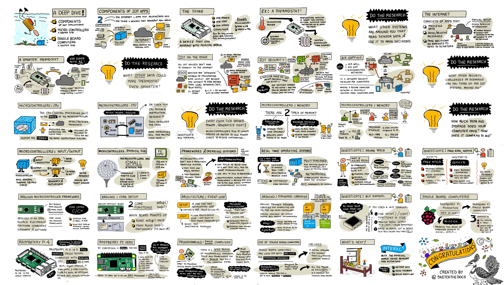
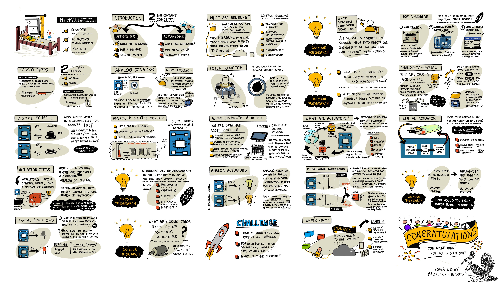
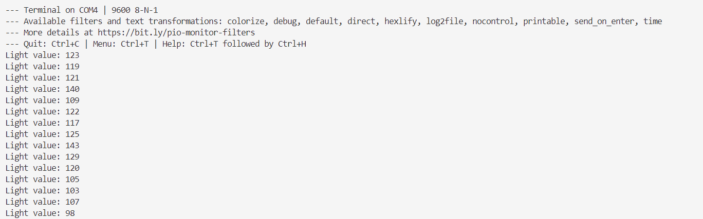

## 一、物联网简介

### 1. 什么是物联网（IOT）

物联网使用传感器将物理世界连接到互联网。物联网中的“物”是一个大型的设备生态系统，这些设备能够：

- 采集数据（使用传感器）
- 和物理世界交互（使用执行器）
- 与其它设备和网络互联

### 2.微控制器和单板机

首先，物联网中的”物“是指那些和物理世界交互的设备。一些是适用于工业生产，需要针对环境进行定制；一些是针对开发者量身设计的，仅适用于开发探究本身，不宜运用到生产环境。

微控制器(MCU)是带有基础的传感器和执行器的低成本计算设备，价格相当便宜。例如 Wio Terminal 套件，它带有传感器和执行器，展示屏幕、蓝牙和WI-FI，同时兼容 Arduino ，擅长单任务。

单板机(SBC)是带有一个完整计算机的所有元素的小型计算设备，很接近桌面电脑（MAC/PC），但是更便宜，更小、耗能更低，一般都有CPU、内存、I/O（和微控制器一样），再加上图形芯片（用于展示）、USB端口（增加外设）、安全数字卡（存储代码、数据）等，适合多任务处理，例如树莓派，一般使用 Python 编程。

### 3.硬件选择

本套课程可以选择微控制器（推荐 Arduion Wio Terminal ），或者单板机（树莓派），甚至你可以不购买任何的硬件设备，选择使用虚拟设备模拟。

上述硬件设备的购买可咨询[矽递科技 ](https://www.seeedstudio.com.cn/)，虚拟硬件请访问这个[GitHub仓库](https://github.com/CounterFit-IoT/CounterFit)进行配置。

### 4.物联网的应用

|      领域      |                         含义                         |                 示例                 |
| :------------: | :--------------------------------------------------: | :----------------------------------: |
|   消费物联网   | 消费者在家庭周围使用设备， 尤其针对带有残疾的家庭 |   智能语音、机器吸尘器、监控监测器   |
|   商业物联网   |                在工作场所应用的物联网                |    温度追踪、占用传感器、动作跟踪    |
|   工业物联网   |              大规模控制和管理机器的场所              | 预防性维护、追踪土壤温湿度、安全监测 |
| 基础设施物联网 |                监测和控制全局基础设施                |          智能电网、智慧城市          |

## 二、深入了解物联网

### 1.物联网应用的组件

|         组件         |         解释         |                         特点                         |
| :------------------: | :------------------: | :--------------------------------------------------: |
| 网络（The Internet） | 应用通过网络收发数据 | 云服务中介：传感器交互、处理安全事务、与其他应用互连 |
|   物（The Thing）    |  感知现实世界的设备  |            低功耗、低成本、低速、长期运行            |

注：不是所有的物联网设备都需要连接到网络，边缘设备能像网关那样能够本地处理数据，可通过局域网（如WIFI、蓝牙）互相连接。

### 2.物联网安全

在现实中，物联网设备通常连接到云端，其安全性仅取决于云端以及网络的安全性。 恶意软件、病毒攻击等可以通过恶意数据传播的方式造成巨大的危害，例如Stuxnet worm（一种恶意计算机蠕虫）攻击或者入侵婴儿监护设备。

解决方法：**空气隔离**（air gapping）。空气隔离是一种网络安全措施，通过物理隔离计算机或网络，防止其与不安全的网络（如互联网或其他不安全的局域网）建立连接。

### 3.深入了解微控制器

CPU 是微控制器的“大脑”，每一个时钟周期执行一条指令。在每一个时钟周期内，CPU 按照取指→解码→执行的顺序执行任务，某些指令可能需要多个时钟周期才能完成。每一个时钟周期消耗电力，产生热量，微控制器以低速运行或者切换低功耗模式以节省开销。

- 微控制器中的存储分为两类：程序存储和随机存取（**RAM**）。前者用于存储程序代码，在断电的时候程序仍然存在 ；后者用于在通电的时候运行程序，并且断电后内容重置。

- 微控制器还有通用输入/输出引脚，用于跟传感器和执行器交互。

- 微控制器很小， Wio Terminal 为$72×57×12$，单位为毫米。
- 微控制器上不运行传统的操作系统，它使用框架以一种可以在其它目标微控制器运行的方式来编写代码，调用 API 接口和外设交互。
- 实时操作系统（**RTOS**）被设计来处理实时发送/接收信息任务，轻量级，但支持核心特性。特点：支持多线程，能在一个或多个核上以并行的方式运行代码；能通过网络安全通信；针对屏幕的图形用户界面组件。
- Arduino 是一个结合硬件和软件的开源电子平台。它编译出来的代码占空间很小，甚至在资源受限的设备上也能快速运行。
- 两个核心函数：`setup`和`loop`。前者只在启动的时候运行一次，通常是一些初始化代码，如连接到WIFI或云服务；后者会持续运行，直到电量耗尽，通常是一些处理性的代码，如发送或接收传感器数据，并可通过`delay`函数节省功耗（休眠/唤醒循环）。这种架构称为**事件循环**。
- Arduino 提供标准库函数，用于I/O引脚和微控制器交互，并暴露一致的 API 接口，如`delay`函数可暂定程序一段特定的时间，`digitalRead`可读取I/O引脚的值（高或低）。

### 4.深入了解单板机

树莓派基金会是来自于英国的慈善机构，成立于2009年，旨在促进计算机科学研究，特别是学校层面。作为这项任务的一部分，他们开发了一种单板计算机，称为Raspberry Pi (树莓派)。树莓派目前有 3 种版本 - 全尺寸版本、尺寸较小的树莓派 Zero 和可以内置到物联网终端设备中的计算模块。

树莓派的所有版本都可运行一个名为树莓派 OS 的 Debian Linux 分支系统。这是没有桌面的精简版，非常适合不需要屏幕的“无头”项目，也可运行具有完整桌面环境的版本，其带有Web浏览器，办公应用程序，编码工具和游戏。由于该操作系统基于 Debian Linux，你可以安装任何 ARM 架构下 Debian 的应用程序或工具。

单板计算机是运行完整操作系统的完整计算机。这意味着你可以使用多种编程语言、框架和工具来编写程序，这与 Arduino 一类的微控制器需要开发板架构支持不同。大多数编程语言都有可以访问 GPIO 引脚以收发来自传感器和执行器的数据。

## 三、用传感器和执行器跟物质世界互相作用

### 传感器

#### 1.什么是传感器

**传感器**是一组感知物理世界的硬件设备，它们测量物理世界的性质并将数据返回给物联网设备。常见的传感器有温湿度传感器、按钮（交互）、光传感器（光的强度或颜色）、摄像头、加速度传感器、麦克风等。所有的传感器将感知到的输入转换成物联网设备能够解释的电子信号。

#### 2.使用传感器

Wio Terminal 内置了一个光敏传感器（光电二极管），它将模拟信号转换成整型（0-1023），0通常表示没有光线，而1023表示光线最强。

输出示例

#### 3.传感器分类

|      类型      |                             原理                             |                  输出                  |    示例    |
| :------------: | :----------------------------------------------------------: | :------------------------------------: | :--------: |
|   模拟传感器   | 传感器从IOT设备接收电压，调整后返回给设备， 设备能够读取来自传感器的电压值并感受到变化。 | 产生一个与感应输入成比例的连续模拟信号 | 温度传感器 |
|   数字传感器   |    输出数字信号（要么通过使用二元状态或通过使用adc生成）     |           产生离散值（0或1）           |   灯开关   |
| 高级数字传感器 |           读取模拟信号，借助板上adc转换成数字信号            |           输出纯粹的数字信号           |  数字相机  |

**数字数据的优势**：

- 传感器可以更加复杂，发送更详细的数据
- 更易于加密数据，以保证安全传输
- 对环境和电子噪声更加免疫
- 在数字处理系统中更多的灵活性

#### 4.转换器

|       类型        |                             解释                             |                      实际情况                       |
| :---------------: | :----------------------------------------------------------: | :-------------------------------------------------: |
| 模数转换器（adc） | 在IOT设备使用之前，模拟传感器需要将值“数字化”    许多设备都有内置的adc，或者通过连接器板与adc工作 | 针对传感器/设备的软件库帮你处理了这方面的细节，透明 |
| 数模转换器（dac） |           需要将物联网设备的数字输出转换为模拟电压           |                          /                          |

### 执行器

#### 1.什么是执行器

执行器可以看成是传感器的对立产品，它将从IOT设备中获取到的电子信号转换成真实世界中的行动。

示例：发光二极管、扬声器、继电器、屏幕、步进电机

#### 2.使用执行器

建立一个夜光灯，当监测到的亮度低于某个值时，开灯。

#### 3.执行器类型

执行器有控制信号和能量来源。基于信号，它能将能量转换成动作或者交互。例如，控制信号触发旋转开关移动，从而点亮房间内的灯。

|    类型    |                            解释                             |                  示例                   |
| :--------: | :---------------------------------------------------------: | :-------------------------------------: |
| 模拟执行器 |  模拟执行器将模拟信号转换为与所供电压成比例的某种交互作用   |             可调亮度型光灯              |
| 数字执行器 | 有两种状态（高或低电平）或内置的dac将数字输入转换成模拟信号 | 简单的LED（高电平为开灯，低电平为关灯） |

#### 4.脉冲宽度调制（PWM）

PWM是一种通过改变脉冲信号的占空比（即脉冲的开启和关闭时间的比例）来模拟模拟信号的技术。虽然PWM产生的是数字信号，但通过调整占空比，可以使输出信号的平均电压或功率在一定范围内变化，从而实现类似模拟信号的效果。

工作原理：

- **占空比（Duty Cycle）**：占空比是指脉冲信号在一个周期内处于高电平（开启状态）的时间比例。例如，50%的占空比意味着在一个周期内，信号有一半时间处于高电平，另一半时间处于低电平。

- **周期（Cycle）**：周期是指脉冲信号重复一次的时间长度。例如，一个周期为0.2秒的PWM信号，每0.2秒重复一次。
- **平均电压（Average Voltage）**：通过改变占空比，可以改变PWM信号的平均电压。例如，一个5V的PWM信号，如果占空比为25%，则平均电压为1.25V（5V × 25%）。

应用：

- **电机速度控制**：通过改变PWM信号的占空比，可以控制电机的转速。例如，占空比越高，电机转速越快；占空比越低，电机转速越慢。
- **LED亮度控制**：通过改变PWM信号的占空比，可以控制LED的亮度。例如，占空比越高，LED越亮；占空比越低，LED越暗。

## 四、将你的设备连接到互联网
