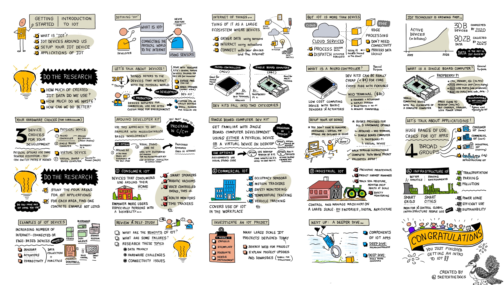

[TOC]

## 一、物联网简介

### 1. 什么是物联网（IOT）

物联网使用传感器将物理世界连接到互联网。物联网中的“物”是一个大型的设备生态系统，这些设备能够：

- 采集数据（使用传感器）
- 和物理世界交互（使用执行器）
- 与其它设备和网络互联

### 2.微控制器和单板机

首先，物联网中的”物“是指那些和物理世界交互的设备。一些是适用于工业生产，需要针对环境进行定制；一些是针对开发者量身设计的，仅适用于开发探究本身，不宜运用到生产环境。

微控制器(MCU)是带有基础的传感器和执行器的低成本计算设备，价格相当便宜。例如`WIO TERMINAL`套件，它带有传感器和执行器，展示屏幕、蓝牙和WI-FI，同时兼容`Arduion`，擅长单任务。

单板机(SBC)是带有一个完整计算机的所有元素的小型计算设备，很接近桌面电脑（MAC/PC），但是更便宜，更小、耗能更低，一般都有CPU、内存、I/O（和微控制器一样），再加上图形芯片（用于展示）、USB端口（增加外设）、安全数字卡（存储代码、数据）等，适合多任务处理，例如树莓派，一般使用`Python`编程。

### 3.硬件选择

本套课程可以选择微控制器（推荐`Arduion Wio Terminal`），或者单板机（树莓派），甚至你可以不购买任何的硬件设备，选择使用虚拟设备模拟。

上述硬件设备的购买可咨询[矽递科技 ](https://www.seeedstudio.com.cn/)，虚拟硬件请访问这个[GitHub仓库](https://github.com/CounterFit-IoT/CounterFit)进行配置。

### 4.物联网的应用

|      领域      |                         含义                         |                 示例                 |
| :------------: | :--------------------------------------------------: | :----------------------------------: |
|   消费物联网   | 消费者在家庭周围使用设备， 尤其针对带有残疾的家庭 |   智能语音、机器吸尘器、监控监测器   |
|   商业物联网   |                在工作场所应用的物联网                |    温度追踪、占用传感器、动作跟踪    |
|   工业物联网   |              大规模控制和管理机器的场所              | 预防性维护、追踪土壤温湿度、安全监测 |
| 基础设施物联网 |                监测和控制全局基础设施                |          智能电网、智慧城市          |

## 第二节——深入了解物联网

## 第三节——用传感器和执行器跟物质世界互相作用

